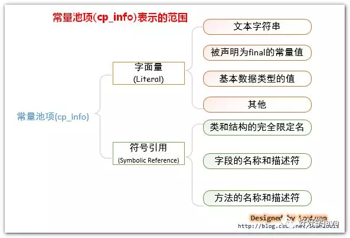
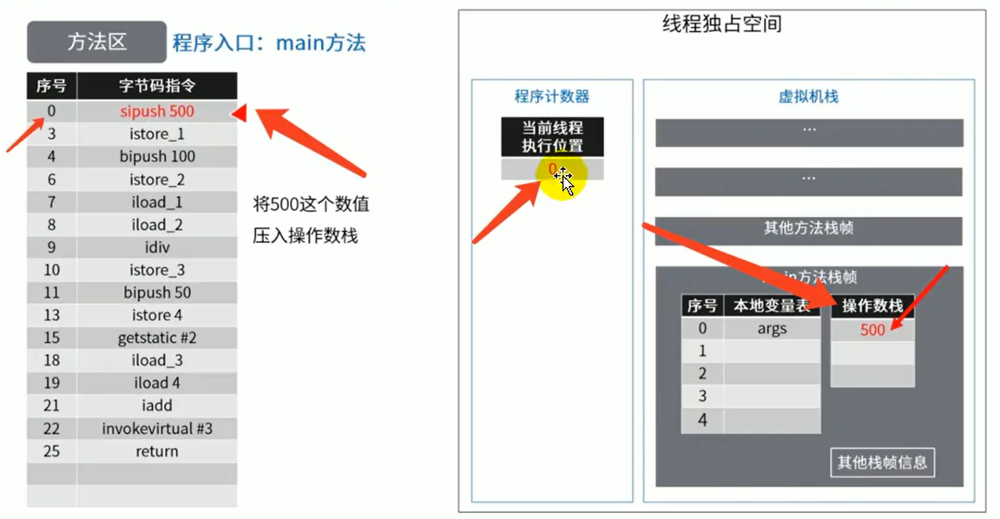

# 方法区

## 前言

这次所讲述的是运行时数据区的最后一个部分


从线程共享与否的角度来看


ThreadLocal通过复制一份数据给线程单独拥有来达到数据线程私有的目的。**典型应用就是数据库连接管理，以及会话管理**

## 栈、堆、方法区的交互关系

下面就涉及了对象的访问定位


- Person：存放在元空间，也可以说方法区
- person：存放在Java栈的局部变量表中
- new Person()：存放在Java堆中

## 方法区的理解

方法区看作是一块独立于Java堆的内存空间。

方法区主要存放的是 Class，而堆中主要存放的是 实例化的对象

- **方法区（Method Area）与Java堆一样，是各个线程共享的内存区域。**
- 方法区在JVM启动的时候被创建，并且它的实际的物理内存空间中和Java堆区一样可以是不连续的。
- 方法区的大小，跟堆空间一样，可以选择固定大小或者可扩展。
- 方法区的大小决定了系统可以保存多少个类，如果系统定义了太多的类，导致方法区溢出，虚拟机同样会抛出内存溢出错误：java.lang.OutofMemoryError：**PermGen space** 或者java.lang.OutOfMemoryError:**Metaspace**，
- 以下三种可能导致方法区内存溢出
  - 加载大量的第三方的jar包
  
  - Tomcat部署的工程过多（30~50个）
  
  - 大量动态的生成反射类
  
- 关闭JVM就会释放这个区域的内存。

### HotSpot中方法区的演进

在jdk7及以前，习惯上把方法区，称为永久代。jdk8开始，使用元空间取代了永久代。JDK 1.8后，元空间存放在堆外内存中

本质上，方法区和永久代并不等价。仅是对hotspot而言的。《Java虚拟机规范》对如何实现方法区，不做统一要求。例如：BEAJRockit / IBM J9 中不存在永久代的概念。            
>现在来看，**当年使用永久代，不是好的idea。导致Java程序更容易oom**（超过-XX:MaxPermsize上限）

而到了JDK8，终于完全废弃了永久代的概念，改用与JRockit、J9一样在本地内存中实现的元空间（Metaspace）来代替

元空间的本质和永久代类似，都是对JVM规范中方法区的实现。

**元空间与永久代最大的区别在于**：**元空间不在虚拟机设置的内存中，而是使用本地内存**

**永久代、元空间二者并不只是名字变了，内部结构也调整了**

根据《Java虚拟机规范》的规定，如果方法区无法满足新的内存分配需求时，将抛出OOM异常

## 设置方法区大小与OOM

方法区的大小不必是固定的，JVM可以根据应用的需要动态调整。 

### jdk7及以前

- 通过-xx:Permsize来设置永久代初始分配空间。默认值是20.75M
- -XX:MaxPermsize来设定永久代最大可分配空间。32位机器默认是64M，64位机器默认是82M
- 当JVM加载的类信息容量超过了这个值，会报异常OutofMemoryError:PermGen space。


### JDK8以后

**元数据区大小可以使用参数 -XX:MetaspaceSize 和 -XX:MaxMetaspaceSize指定**

默认值依赖于平台。windows下，-XX:MetaspaceSize是21M，-XX:MaxMetaspaceSize是**-1**，**即没有限制。**所以与永久代不同，如果不指定大小，默认情况下，虚拟机会耗尽所有的可用系统内存。如果元数据区发生溢出，虚拟机一样会抛出OutOfMemoryError:Metaspace异常

-XX:MetaspaceSize：设置初始的元空间大小。对于一个64位的服务器端JVM来说，其默认值为21MB。

**这就是初始的高水位线，**一旦触及这个水位线，FullGC将会被触发并卸载没用的类（即这些类对应的类加载器不再存活）然后这个高水位线将会重置。**新的高水位线的值取决于GC后释放了多少元空间**。如果释放的空间不足，那么在不超过MaxMetaspaceSize时，适当提高该值。如果释放空间过多，则适当降低该值。

如果初始化的高水位线设置过低，上述高水位线调整情况会发生很多次。通过垃圾回收器的日志可以观察到FullGC多次调用。

为了避免频繁地GC，**建议将-XX:MetaspaceSize设置为一个相对较高的值。**

### 如何解决这些OOM（拓展）

- 要解决ooM异常或heap space的异常，一般的手段是首先通过内存映像分析工具（如Ec1ipse Memory Analyzer）对dump出来的堆转储快照进行分析。

  **重点是**确认内存中的对象是否是必要的，也就是要先分清楚到底是出现了**内存泄漏**（Memory Leak）还是**内存溢出**（Memory Overflow）

     内存泄漏就是有大量的引用指向某些对象，但是这些对象以后不会使用了，但是因为它们还和GC ROOT有关联，所以导致以后这些对象也不会被回收，**这就是内存泄漏的问题**

- 如果是内存泄漏，可进一步通过工具查看泄漏对象到GC Roots的引用链。于是就能找到泄漏对象是通过怎样的路径与GCRoots相关联并导致垃圾收集器无法自动回收它们的。掌握了泄漏对象的类型信息，以及GCRoots引用链的信息，就可以比较准确地定位出泄漏代码的位置。

- 如果不存在内存泄漏（那就是内存溢出），换句话说就是内存中的对象确实都还必须存活着，那就应当检查虚拟机的堆参数（-Xmx与-Xms），与机器物理内存对比看是否还可以调大，从代码上检查是否存在某些对象生命周期过长、持有状态时间过长的情况，尝试减少程序运行期的内存消耗。

## 2、方法区的内部结构（重要）


《深入理解Java虚拟机》书中对**方法区（Method Area）存储内容**描述如下：

**它用于存储已被虚拟机加载的类型信息、常量（final修饰）、静态变量、即时编译器编译后的代码缓存等。**


==静态变量和字符串常量池存放在堆中。普通成员变量随对象实例存放在堆中，局部变量随方法存放在栈帧中。==

### 2.1类型信息

对每个加载的类型（类class、接口interface、枚举enum、注解annotation），JVm必须在方法区中存储以下类型信息：

- 这个类型的完整有效名称（全名=包名.类名）
- 这个类型直接父类的完整有效名（对于interface或是java.lang.object，都没有父类）
- 这个类型的修饰符（public，abstract，final的某个子集）
- 这个类型直接接口的一个有序列表

### 2.2域/field(成员变量)信息

JVM必须在方法区中保存类型的所有域的相关信息以及域的声明顺序。

域的相关信息包括：域名称、域类型、域修饰符（public，private，protected，static，final，volatile，transient的某个子集）

### 2.3方法信息

JVM必须保存所有方法的以下信息，同域信息一样包括声明顺序：

- 方法名称
- 方法的返回类型（或void）
- 方法参数的数量和类型（按顺序）
- 方法的修饰符（public，private，protected，static，final，synchronized，native，abstract的一个子集）
- 方法的字节码（bytecodes）、操作数栈、局部变量表及大小（abstract和native方法除外）
- 异常表（abstract和native方法除外）

>每个异常处理的开始位置、结束位置、代码处理在程序计数器中的偏移地址、被捕获的异常类的常量池索引

### 2.4non-final的类（static）变量

静态变量和类关联在一起，随着类的加载而加载，他们成为类数据在逻辑上的一部分

类变量被类的所有实例共享，即使没有类实例时，你也可以访问它，如下代码所示,

```java
/**
 * non-final的类变量
 *
 * @author: 陌溪
 * @create: 2020-07-08-16:54
 */
public class MethodAreaTest {
    public static void main(String[] args) {
        Order order = null; //order并未赋值
        order.hello();
        System.out.println(order.count);
    }
}
class Order {
    public static int count = 1;
    public static final int number = 2;
    public static void hello() {
        System.out.println("hello!");
    }
}
```

**如上代码所示，即使我们把order设置为null，也不会出现空指针异常**，依旧可以访问

### 2.5全局常量

全局常量就是使用 ==static final==进行修饰

被声明为final的类变量的处理方法则不同，每个全局常量在编译的时候就会被分配了。例如int a=1; 会被分配为0，在初始化阶段再被赋值为1.

### ==2.6 java常量池==


   Java的常量池可以细分为以下三类：

- classFile常量池 ，编译阶段  了解
- 运行时常量池（又称动态常量池，运行阶段）重要
- 字符串常量池（全局的常量池） 重要

- **方法区，内部包含了运行时常量池**
- **字节码文件，内部包含了常量池**
- 要弄清楚**方法区**，需要理解清楚**CLassFile**（字节码文件），因为加载类的信息都在CLassFile.
- 要弄清楚**方法区的运行时常量池**，需要理解清楚**CLassFile中的常量池**。


###  2.6.1 classFile的常量池

 class文件常量池，也被称为 **静态常量池** ，它是.class文件所包含的一项信息。用于存放编译器生成的各种字面量(Literal)和符号引用(Symbolic References)。常量池在.class文件的位置

**下面的图随便看看**


一个有效的字节码文件中除了包含类的版本信息、字段、方法以及接口等描述符信息外，还包含一项信息就是**常量池表**（Constant Pool Table），包括各种**字面量**和对类型、域和方法的**符号引用**

**字面量**： 就是上面所说的字面常量。
**符号引用**： 是一组符号来描述所引用的目标，符号可以是任何形式的字面量，只要使用时能无歧义地定位到目标即可（它与直接引用区分一下，**直接引用** 一般是指向方法区的本地指针，相对偏移量或是一个能间接定位到目标的句柄）。**符号引用可以看作是一个虚拟地址，只有在JVM加载完类，确认了字面量的地址，才会将 符号引用 换成 直接引用**。一般包括下面三类常量：

- 类和接口的全限定名
- 字段的名称和描述符
- 方法的名称和描述符

常量池的信息




#### 2.6.1.1为什么需要常量池

一个java源文件中的类、接口在编译后产生一个字节码文件。而Java中的字节码需要数据支持，通常这种数据会很大以至于不能直接存到字节码里，换另一种方式，可以存到常量池，这个字节码包含了指向常量池的引用。**在动态链接的时候会用到运行时常量池，**之前有介绍。

比如：如下的代码：

```java
public class SimpleClass {
    public void sayHello() {
        System.out.println("hello");
    }
}
```

虽然上述代码只有194字节，但是里面却使用了String、System、PrintStream及Object等结构。这里的代码量其实很少了，如果代码多的话，引用的结构将会更多，这时就需要用到常量池了。

#### 2.6.1.2常量池中有什么

- 数量值
- 字符串值
- 类引用
- 字段引用
- 方法引用

小结

**常量池可以看做是一张表，虚拟机指令根据这张常量表找到要执行的类名、方法名、参数类型、字面量等类型**

### 2.6.2运行时常量池

[好好学java的 ](https://mp.weixin.qq.com/s?__biz=MzI2OTQ4OTQ1NQ==&mid=2247484002&idx=1&sn=a1d9ec01c91537aca444408c989f5a50&scene=19#wechat_redirect)

```
 
 运行时常量池，又称为 动态常量池 ，是JVM在完成加载类之后将class文件中常量池载入到内存中，并保存在方法区中。也就是说，运行时常量池中的常量，基本来源于各个class文件中的常量池。 运行时常量池相对于CLass文件常量池的另外一个重要特征是具备 动态性 ，Java语言并不要求常量一定只有编译期才能产生，也就是并非预置入CLass文件中常量池的内容才能进入方法区运行时常量池，运行期间也可能将新的常量放入池中，这种特性被开发人员利用比较多的就是String类的intern()方法。

  jvm在执行某个类的时候，必须经过加载、连接、初始化，而连接又包括验证、准备、解析三个阶段。而当类加载到内存中后，jvm就会将class常量池中的内容存放到运行时常量池中，也就是说，每个class对应运行时常量池中的一个独立空间，每个class文件存放的位置互不干扰。而在解析阶段，就会将符号引用替换成对应的直接引用。
  不过，String类型 的字面常量要注意：并不是直接在堆上分配空间来创建对象的，JVM为String 字符串额外维护了一个常量池 字符串常量池，所以遇到字符串常量是要先去字符串池中寻找是否有重复，如果有，则返回对应的引用。否则，才创建并添加到字符串常量池中。换句话说，对于String类型的字面常量，必须要在 字符串常量池 中维护一个全局的引用。
  
  3、 字符串常量池（string pool也有叫做string literal pool）
   字符串常量池存储的就是字符串的字面常量。详细一点，字符串常量池里的内容是在类加载完成，经过验证，准备阶段之后在堆中生成字符串对象实例，然后将该字符串对象实例的引用值存到string pool中（记住：string pool中存的是引用值而不是具体的实例对象，具体的实例对象是在堆中开辟的一块空间存放的。）。
在HotSpot VM里实现的string pool功能的是一个StringTable类，它是一个哈希表，里面存的是驻留字符串(也就是我们常说的用双引号括起来的)的引用（而不是驻留字符串实例本身），也就是说在堆中的某些字符串实例被这个StringTable引用之后就等同被赋予了”驻留字符串”的身份。这个StringTable在每个HotSpot VM的实例只有一份，被所有的类共享。

运行时常量池 与 字符串常量池 的区别

字符串常量池是位于运行时常量池中的。

  网上有不少文章是将字符串常量池作为运行时常量池同等来说，我一开始也以为这两者就是同一个东西，其实不然。运行时常量池 与 字符串常量池 在HotSpot的JDK1.6以前，都是放在方法区的，JDK1.7就将字符串常量池移到了堆外内存中去。运行时常量池 为每一个Class文件的常量池提供一个运行时的内存空间；而字符串常量池则为所有Class文件的String类型的字面常量维护一个公共的常量池，也就是Class文件的常量池加载进运行时常量池后，其String字面常量的引用指向要与字符串常量池的维护的要一致。
```

​	

**常量池表（Constant Pool Table）是ClassFile的一部分**，用于存放编译期生成的各种字面量与符号引用，这部分内容将在类加载后存放到**方法区的运行时常量池中**。

在加载类和接口到虚拟机后，就会创建对应的运行时常量池。

JVM为每个已加载的类型（类或接口）都维护一个常量池。池中的数据项和数组项一样，是通过索引访问的。

运行时常量池中包含多种不同的常量，包括编译期就已经明确的数值字面量，也包括到运行期解析后才能够获得的方法或者字段引用。此时不再是常量池中的符号地址了，这里换为真实地址。

**运行时常量池，相对于Class文件常量池的另一重要特征是：具备动态性。**

 运行时常量池类似于传统编程语言中的符号表（symboltable），但是它所包含的数据却比符号表要更加丰富一些。

当创建类或接口的运行时常量池时，如果构造运行时常量池所需的内存空间超过了方法区所能提供的最大值，则JVM会抛outofMemoryError异常。

## 方法区使用举例

如下代码

```java
public class MethodAreaDemo {
    public static void main(String args[]) {
        int x = 500;
        int y = 100;
        int a = x / y;
        int b = 50;
        System.out.println(a+b);
    }
}
```

字节码执行过程展示


首先将操作数500放入到操作数栈中



然后存储到局部变量表中


然后重复一次，把100放入局部变量表中，最后再将变量表中的500 和 100 取出，进行操作


将500 和 100 进行一个除法运算，再把结果入栈


在最后就是输出流，需要调用运行时常量池的常量


最后调用invokevirtual（虚方法调用），然后返回


返回时


**程序计数器始终计算的都是当前代码运行的位置，目的是为了方便记录 方法调用后能够正常返回，或者是进行了CPU切换后，也能回到原来的代码位置进行执行。**

## 方法区的演进细节

首先明确：只有Hotspot才有永久代。BEA JRockit、IBMJ9等来说，是不存在永久代的概念的。原则上如何实现方法区属于虚拟机实现细节，不受《Java虚拟机规范》管束，并不要求统一

Hotspot中方法区的变化：

| JDK1.6及以前 | 有永久代，静态变量存储在永久代上                             |
| ------------ | ------------------------------------------------------------ |
| JDK1.7       | 有永久代，但已经逐步 “去永久代”，==字符串常量池，静态变量移除，保存在堆中== |
| JDK1.8       | 无永久代，类型信息，字段，方法，常量**保存在本地内存的方法区**，==但字符串常量池、静态变量仍然在堆中。== |

JDK6的时候


JDK7的时候


JDK8的时候，元空间大小只受物理内存影响


### 为什么永久代要被元空间替代？

由于类的元数据分配在本地内存中，元空间的最大可分配空间就是系统可用内存空间，这项改动是很有必要的，原因有：

- **1 为永久代设置空间大小是很难确定的。**：在某些场景下，如果动态加载类过多，容易产生永久代的oom。比如某个实际Web工
  程中，因为功能点比较多，在运行过程中，要不断动态加载很多类，经常出现致命错误。而元空间和永久代之间最大的区别在于：元空间并不在虚拟机中，而是使用本地内存。因此，默认情况下，**元空间的大小仅受本地内存限制。**

- **2  对永久代进行调优是很困难的。**

  所以永久代要被元空间替代。


## StringTable为什么要调整位置？

jdk7中将StringTable放到了堆空间中。因为永久代的回收效率很低，在full gc的时候才会触发。**这就导致stringTable回收效率不高**。而我们开发中会有大量的字符串被创建，回收效率低，导致永久代内存不足。**放到堆里，能及时回收内存。**

### 静态变量存放在那里？

**静态引用对应的对象实体始终都存在堆空间**

可以使用 jhsdb.ext，需要在jdk9的时候才引入的

**staticobj随存放在堆中，instanceobj随着Test的对象实例存放在Java堆，localobject则是存放在foo（）方法栈帧的局部变量表中。**


测试发现：三个对象的数据在内存中的地址都落在Eden区范围内，所以结论：==只要是对象实例必然会在Java堆中分配。==

接着，找到了一个引用该staticobj对象的地方，是在一个java.1ang.Class的实例里，并且给出了这个实例的地址，通过Inspector查看该对象实例，可以清楚看到这确实是一个java.lang.Class类型的对象实例，里面有一个名为staticobj的实例字段：


从《Java虚拟机规范》所定义的概念模型来看，**所有Class相关的信息都应该存放在方法区之中**，但方法区该如何实现，《Java虚拟机规范》并未做出规定，这就成了一件允许不同虚拟机自己灵活把握的事情。**JDK7及其以后版本的HotSpot虚拟机选择把静态变量与类型在Java语言一端的映射class对象存放在一起==，存储于Java堆之中==，从我们的实验中也明确验证了这一点**

## 方法区垃圾回收  

 有些人认为方法区是没有垃圾收集行为的，其实不然。**《Java虚拟机规范》对方法区的约束是非常宽松的**，提到过可以不要求虚拟机在方法区中实现垃圾收集。事实上也确实有未实现或未能完整实现方法区类型卸载的收集器存在（如JDK11时期的ZGC收集器就不支持类卸载）。
一般来说这个区域的回收效果比较难令人满意，尤**其是类型的卸载，条件相当苛刻。**==但是这部分区域的回收有时又确实是必要的==。以前sun公司的Bug列表中，曾出现过的若干个严重的Bug就是由于低版本的HotSpot虚拟机对此区域未完全回收而导致内存泄漏

**方法区的垃圾收集主要回收两部分内容：常量池中废弃的常量和不再使用的类型**

**方法区的常量池之中主要存放的两大类常量**：==字面量和符号引用==。

字面量比较接近Java语言层次的常量概念，如文本字符串、被声明为final的常量值等。int a=10;10就是字面量

**==符号引用==则属于编译原理方面的概念，包括下面三类常量：**

- 类和接口的全限定名
- 字段的名称和描述符
- 方法的名称和描述符

HotSpot虚拟机对常量池的回收策略是很明确的，只要常量池中的常量没有被任何地方引用，就可以被回收。

回收废弃常量与回收Java堆中的对象非常类似。（关于常量的回收比较简单，重点是类的回收）

判定一个常量是否“废弃”还是相对简单，**而要判定一个类型是否属于“不再被使用的类”的条件就比较苛刻了。需要同时满足下面三个条件：**

- **该类所有的实例都已经被回收**，也就是Java堆中不存在该类及其任何派生子类的实例。
  
- **加载该类的类加载器已经被回收**，这个条件除非是经过精心设计的可替换类加载器的场景，如osGi、JSP的重加载等，否则通常是很难达成的。
  
- **该类对应的java.lang.Class对象没有在任何地方被引用**，无法在任何地方通过反射访问该类的方法。Java虚拟机被允许对满足上述三个条件的无用类进行回收，这里说的仅仅是“被允许”，而并不是和对象一样，没有引用了就必然会回收。关于是否要对类型进行回收，HotSpot虚拟机提供了-Xnoclassgc参数进行控制，还可以使用-verbose:class 以及 -XX：+TraceClass-Loading、-XX：+TraceClassUnLoading查看类加载和卸载信息

  在大量使用反射、动态代理、CGLib等字节码框架，动态生成JSP以及oSGi这类频繁自定义类加载器的场景中，通常都需要Java虚拟机具备类型卸载的能力，以保证不会对方法区造成过大的内存压力。

## 总结


### 常见面试题

百度
三面：说一下JVM内存模型吧，有哪些区？分别干什么的？

蚂蚁金服：
Java8的内存分代改进
JVM内存分哪几个区，每个区的作用是什么？
一面：JVM内存分布/内存结构？栈和堆的区别？堆的结构？为什么两个survivor区？
二面：Eden和survior的比例分配

小米：
jvm内存分区，为什么要有新生代和老年代

字节跳动：
二面：Java的内存分区
二面：讲讲vm运行时数据库区
什么时候对象会进入老年代？

京东：
JVM的内存结构，Eden和Survivor比例。
JVM内存为什么要分成新生代，老年代，持久代。新生代中为什么要分为Eden和survivor。

天猫：
一面：Jvm内存模型以及分区，需要详细到每个区放什么。
一面：JVM的内存模型，Java8做了什么改

拼多多：
JVM内存分哪几个区，每个区的作用是什么？

美团：
java内存分配
jvm的永久代中会发生垃圾回收吗？
一面：jvm内存分区，为什么要有新生代和老年代？